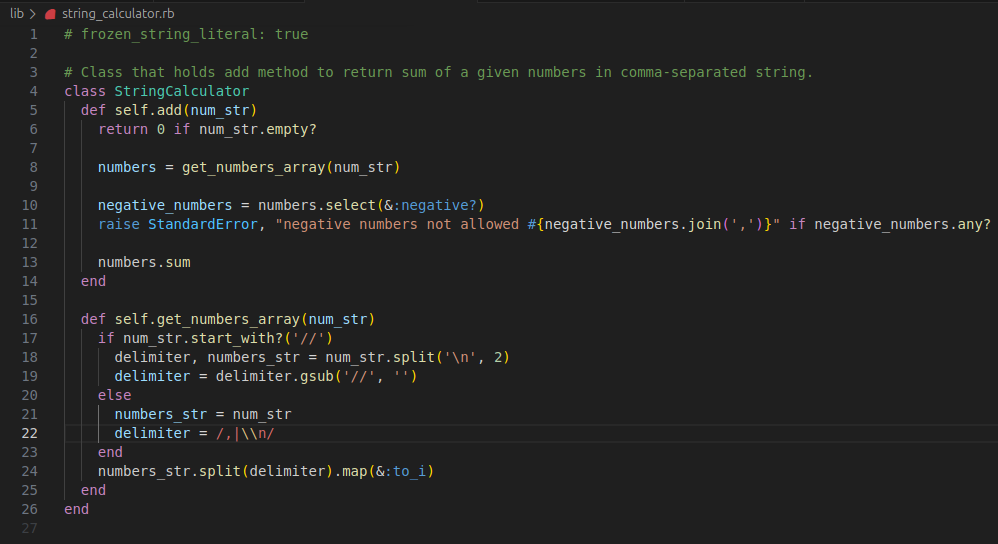
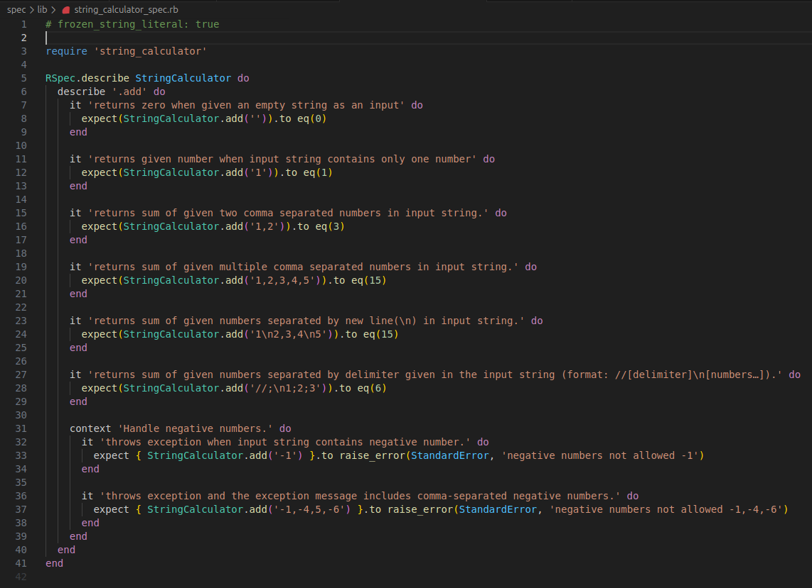
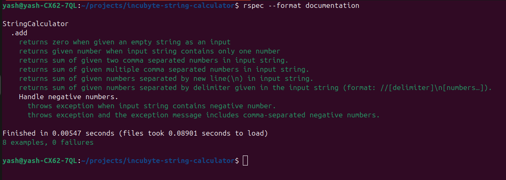

# Project Description

- This project is a TDD assessment from incubyte. It is a string calculator.
- This project includes the `add` method which takes a string of numbers as an argument and returns the sum of those numbers.

# Commit Explanation

1. Initial commit
   - Added informative files for ruby version and gemset.
   - Added Gemfile and corresponding Gemfile.lock.

2. **[Test]:** Add a test case to return zero on an empty string.
   - Added test case for `add` method to return zero when given the empty string as input.
   - Added skeleton for `StringCalculator` class.

3. **[Code]:** Update `add` method to return zero when given an empty string as input.
   - `add` method is updated.

4. **[Test]:** Add a test case for one number in the input string.
   - Added test case to return number if the input string contains a single number.

5. **[Code]:** Update `add` method to handle a single number.
   - Updated `add` method to return a number when given a single number in the input string.

6. **[Refactor]:** Refactor `add` method.
   - Remove an unnecessary condition.

7. **[Test]:** Add a test case for two comma-separated numbers in the input string.
   - Added test case to return the sum of two comma-separated numbers given in the input string.

8. **[Code]:** Update `add` method to handle two numbers.
   - Updated `add` method to return the sum of comma-separated numbers given in the input string.

9. **[Test]:** Add a test case for multiple comma-separated numbers in the input string.
   - Added test case to return the sum of comma-separated numbers given in the input string.

10. **[Test]:** Add a test case to handle new lines.
    - Added test case to return the sum of numbers separated by newlines (\n) in the input string.

11. **[Code]:** Update `add` method to handle new lines.
    - Updated `add` method to return the sum of numbers separated by a comma or by a new line in the input string.

12. **[Test]:** Add a test case to handle delimiters given in the input string.
    - Added test case to consider delimiter given in input string and return sum of numbers separated by it.

13. **[Code]:** Update `add` method to handle different delimiters.
    - Updated `add` method to get delimiter from input string if the string starts with '//' and returns the sum of numbers.
    - Added return statement for the empty string to increase readability.

14. **[Refactor]:** Refactor `add` method.
    - Created a new method to get an array of numbers from a given input string.
    - Make code more readable by applying the dry principle.

15. **[Test]:** Add test cases to handle negative numbers.
    - Added a test case to throw an exception on negative numbers.
    - Added a test case to check that the exception contains a list of negative numbers.

16. **[Code]:** Update `add` method to handle negative numbers.
    - Updated `add` method to throw an exception when input string includes negative numbers.

17. **[Chore]:** Update the Readme file.
    - Fixed grammatical errors.
    - Added screenshots under the `screenshots` folder.
    - Added screenshots for code, test cases and results of test cases.

# Screenshots

